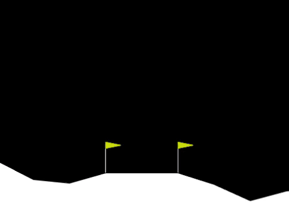

# PPO_LunarLanderContinuous-V2🚀
使用Beta分布和自截断Critic的PPO强化学习算法解决Gym-LunarLanderContinuous-v2问题



*（训练效果）*

## 📌 项目简介
- **描述**：基于PPO强化学习算法的LunarlanderContinuous问题求解


## 🌟 特色亮点
- **Beta分布**：相较于传统采用无限支撑域的高斯分布(Gaussian distribution)作为策略估计的方法，本模型可使用严格定义在[0,1]区间的Beta分布进行策略建模。

- **Critic自截断机制**：针对Critic在训练过程中易衰退的现象，本模型使用了自适应的Critic_loss截断方法,大幅增加训练稳定性

## 🛠️ 项目结构

```bash
Project_Root/
│
├── data/                  
│   │
│   model/                 # 训练好的模型参数(仅有Beta策略)
│   ├── ppo2_continue_Actor_Beta.pth    # Actor网络
│   ├── ppo2Continue_Critic_Beta.pth   # Critic网络
│   │
│   picture/              
│   ├── PPOC_BETA_LunarLanderContinuous-v2.png  # 训练过程记录
│   └── pygamewindow2025-04-2420-09-02-ezgif.com-video-to-gif-converter.gif  # 动态演示gif
│
├── src/                   # 核心源代码
│   │
│   ├── Library/           
│   │   ├── Actor.py       # 策略网络实现（Beta分布版本）
│   │   ├── Agent.py       # 智能体交互逻辑
│   │   └── Critic.py      # 价值评估网络
│   │
│   ├── Run/               # 运行入口
│   │   └── PlayerBeta.py  # Beta策略执行脚本
│   │
│   ├── README.md          # 说明文档
│   └── main.py            # 模型展示

          