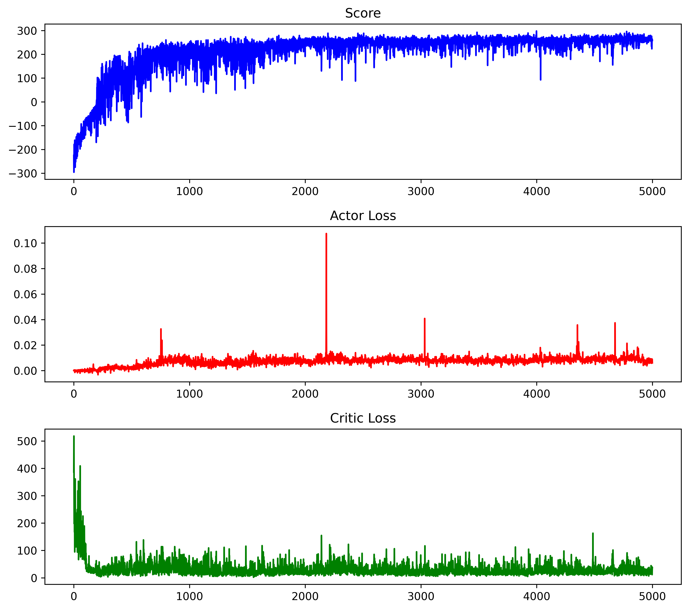

# PPO_LunarLanderContinuous-V2🚀
使用Beta分布和自截断Critic的PPO强化学习算法解决Gym-LunarLanderContinuous-v2问题


# 🚀 改进PPO算法：连续有界动作空间优化方案

## 📌 项目简介
PPO(Proximal Policy Optimization)是OpenAI团队于2018年提出的强化学习算法。该算法在Actor-Critic框架下引入重要性采样和独特的梯度裁剪机制，在离散动作环境中表现出色。
在连续动作空间问题中，PPO通常需将Actor部分的分类问题转化为回归问题,即对每个动作维度输出高斯分布的参数(均值和方差)。然而，这一设计存在两个关键问题：

1. **动作空间有界性与高斯分布无限支撑集的矛盾**  
   🔧 传统高斯策略的无限支撑集与物理系统有限动作范围（如关节角度限制）不兼容  
2. **Critic训练稳定性问题**  
   ⚡ Critic网络在PPO单样本重复训练中易出现振荡和过拟合,增大价值估计偏差，降低策略优化效果。

**针对以上两个问题进行以下改进:**


## 技术改进
| 模块     | 创新点                                 | 技术优势                     |
|--------|-------------------------------------|--------------------------|
| Actor  | Beta分布替代高斯分布                        | 严格匹配[0,1]动作边界,拥有更灵活的策略选择 |
| Critic | 提出对比截断的Critic损失函数，限制价值函数在训练周期内的变化幅度 | Critic训练方差大幅减小，提高模型预测精度  |
| Buffer | 设计优先级动态调整的循环缓冲存储结构，优先采样并训练TD误差较大样本  | 样本利用率提升，提高Critic鲁棒性      |

## 训练过程



# 📦 项目结构与库依赖

```python
库依赖/
torch==2.6.0+cu126      # 深度学习框架
gym==0.26.2             # 强化学习环境（含LunarLanderContinuous-v2）
numpy==1.26.4           # 数值计算
tqdm==4.67.1            # 进度条
matplotlib==3.10.1      # 训练图记录

Project_Root/
│
├── data/                  
│   │
│   model/                 # 训练好的模型（使用请运行run_trained_model）
│   ├── ppo2_continue_Actor_Beta.pth    # Actor网络
│   ├── ppo2Continue_Critic_Beta.pth   # Critic网络
│   │
│   picture/              
│   ├── PPOC_BETA_LunarLanderContinuous-v2.png  # 训练过程记录
│   └── pygamewindow2025-04-2420-09-02-ezgif.com-video-to-gif-converter.gif  # 动态演示gif
│
├── src/                   # 核心源代码
│   │
│   ├── Library/           
│   │   ├── Actor.py       # 策略网络实现（Beta分布版本）
│   │   ├── Agent.py       # 智能体交互逻辑
│   │   └── Critic.py      # 价值评估网络
│   │
│   ├── Run/               
│   │   └── PlayerBeta.py  # Beta策略模型
│   │
│   ├── README.md          # 说明文档
│   ├── main.py            # 模型展示
    └── run_trained_model  # 已训练模型运行脚本
